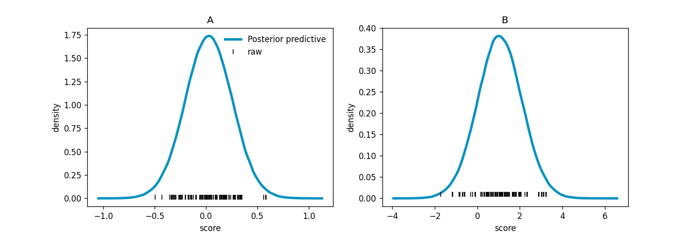
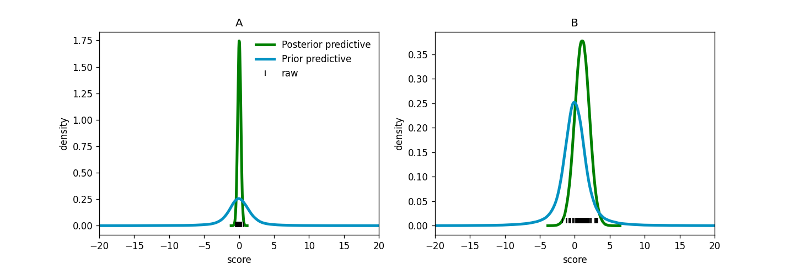

[](https://github.com/psf/black)

# ABayes

ABayes is a lightweight Python package for performing Bayesian AB testing.
Computations are run using [Stan](
https://mc-stan.org
) via [`cmdstanpy`](
https://github.com/stan-dev/cmdstanpy
), and [`jinja2`](
https://github.com/pallets/jinja/
) is used
as a backend templating engine
to construct the Stan model files.

## Installation

To install, use:

```bash
python3.10 -m pip install git+ssh://git@github.com/cmgoold/abayes.git
```

Installing ABayes will also create a local cache folder for storing
Stan model objects, which is `.abayes` in the repository root.

### CmdStan
ABayes requires a working `cmdstan` installation. The easiest
way to download `cmdstan` is [via `cmdstanpy`](
https://mc-stan.org/cmdstanpy/installation.html#function-install-cmdstan
).

## Simple API

The simplest use-case is running a comparison
between two sets of approximately normally-distributed
data sets. First, let's sample some fake data, where
we have two groups with the following data generating
process:

$$
\begin{align}
y_{ij} &\sim \mathrm{Normal}(\mu_{j}, \sigma_{j})\\
\mu_{A} &= 0, \quad \sigma_{A} = 0.2 \\
\mu_{B} &= 1, \quad \sigma_{B} = 1
\end{align}
$$

That is, both groups' data are normally distributed
with locations, `0` and `1`, and scales
`0.2` and `1`, respectively.
Thus, there is a true difference of means of `-1` and
a true difference of scales of `-0.8`. Here's the Python
code:

```python
import numpy as np

from abayes import ABayes

SEED = 1234
rng = np.random.default_rng(SEED)

N = 100
mu = [0, 1]
sigma = [0.2, 1]
y_a = rng.normal(size=N, loc=mu[0], scale=sigma[0]) 
y_b = rng.normal(size=N, loc=mu[1], scale=sigma[1]) 
```

We then initialize an `ABayes` object with the default options
(normal likelihood, default priors) and fit the model, passing
the data in as a tuple:

```python
ab = ABayes(seed=SEED)
ab.fit(data=(y_a, y_b))
```

The model will run in Stan and return `self`.
You can access the `cmdstanpy.CmdStanMCMC` object
itself using `ab.cmdstan_mcmc`. 
For instance, we can use `cmdstanpy`'s diagnostic
function to check for any convergence problems:

```python
ab.diagnose()
```

which returns:

```
Checking sampler transitions treedepth.
Treedepth satisfactory for all transitions.

Checking sampler transitions for divergences.
No divergent transitions found.

Checking E-BFMI - sampler transitions HMC potential energy.
E-BFMI satisfactory.

Effective sample size satisfactory.

Split R-hat values satisfactory all parameters.

Processing complete, no problems detected.
```

indicating no problems.

To inspect the results, run `ab.summary()`, which returns
a summary Pandas `DataFrame` straight from [`Arviz`](
https://github.com/arviz-devs/arviz
):

```
                  mean     sd  hdi_3%  hdi_97%  mcse_mean  mcse_sd  ess_bulk  ess_tail  r_hat
mu[0]            0.026  0.023  -0.018    0.067      0.000    0.000    4655.0    3215.0    1.0
mu[1]            1.059  0.105   0.851    1.249      0.001    0.001    5554.0    3166.0    1.0
mu_diff         -1.033  0.108  -1.222   -0.820      0.001    0.001    5566.0    3225.0    1.0
mu_star[0]       0.026  0.023  -0.018    0.067      0.000    0.000    4655.0    3215.0    1.0
mu_star[1]       1.059  0.105   0.851    1.249      0.001    0.001    5554.0    3166.0    1.0
mu_star_diff    -1.033  0.108  -1.222   -0.820      0.001    0.001    5566.0    3225.0    1.0
sigma[0]         0.229  0.016   0.199    0.259      0.000    0.000    4938.0    3202.0    1.0
sigma[1]         1.046  0.077   0.904    1.190      0.001    0.001    4530.0    2968.0    1.0
sigma_diff      -0.817  0.078  -0.973   -0.681      0.001    0.001    4504.0    3051.0    1.0
sigma_star[0]   -1.478  0.071  -1.616   -1.349      0.001    0.001    4938.0    3202.0    1.0
sigma_star[1]    0.042  0.073  -0.101    0.174      0.001    0.001    4530.0    2968.0    1.0
sigma_star_diff -1.520  0.101  -1.709   -1.334      0.001    0.001    4755.0    3271.0    1.0
```

ABayes always uses the parameter `mu` to refer to 
the vector of group-specific locations, or other non-normal
distribution's canonincal parameters (e.g. the Poisson
rate parameter; see below). Dispersion parameters,
such as the normal distribution's scale parameter,
are referred to as `sigma`.

The parameters suffixed with `_star` are unconstrained
parameters, which ABayes uses for estimation under-the-hood.
More details about the parameter transformations and 
likelihood parameterisations are given below, but
for the normal distribution, `mu = mu_star` and `sigma_star = log(sigma)`.
Conditions A and B are always indexed as `0` and `1`
in the Python outputs.
The additional variables `mu_diff` and `sigma_diff` (and
the `_star` companions) give
the difference in posterior distributions between groups 1 and 2
(i.e. `mu[0] - mu[1]` using Python's zero-indexing).
As we can see, these recover the data-generating assumptions above,
with posterior means close to `-1` and `-0.8` for the means
and standard deviations, respectively.

Using the estimated quantities, users can calculate
any quantities or metrics that are meaningful
to the AB test being performed. For instance,
the probability that condition B scores greater than
A is the proportion of the posterior distribution
of `mu[1] - mu[0]` that is greater than zero,
which in this case is 100%, as can be inferred
from the `mu_diff` distribution directly:

```python
import matplotlib.pyplot as plt
from scipy.stats import gaussian_kde

def density(x):
    limits = x.min(), x.max()
    grid = np.linspace(*limits, 1000)
    return grid, gaussian_kde(x)(grid)

mu_diff = ab.draws()["mu_diff"]

plt.plot(*density(mu_diff), color="#0492c2", lw=4)
plt.axvline(0, ls=":", color="gray")
plt.xlabel("score")
plt.ylabel("density")
plt.title("posterior of condition A - B")
```


The `ABayes` class also contains a handy method
to report the distribution of
differences in the posteriors
between conditions called
`compare_conditions`, which
tells us that:

```
100.00% of the posterior differences for mu favour condition B.
100.00% of the posterior differences for sigma favour condition B.
```

## Posterior predictive distribution
ABayes automatically calculates the posterior predictive
distribution of the data, which is accessible in
the posterior draws object under the key `y_rep`. 
This array is in long form, where group A and B's
predictions are stacked on top of each other.
Using the example above, we can inspect this
distribution using some small manipulation
of the posterior draws:

```python
y_rep_raw = ab.draws()["y_rep"]
y_reps = y_rep_raw[:, :N], y_rep_raw[:, N:]
ys = y_a, y_b

fig, ax = plt.subplots(1, 2, figsize=(12, 4))
for i in range(2):
    a_or_b = (1 - i) * "A" + i * "B"
    grid, samples = density(y_reps[i].flatten())
    ax[i].plot(grid, samples, color="#0492c2", lw=3, label="Posterior predictive")
    ax[i].plot(ys[i], [0.01]*len(ys[i]), '|', color="black", label="raw")
    ax[i].set_title(a_or_b)
    ax[i].set_xlabel("score")
    ax[i].set_ylabel("density")
    if not i:
        ax[i].legend(frameon=False, loc="upper right")
```



The rug plots show that the observed data fall within
the posterior predictive densities.

# Likelihood functions

Currently, ABayes supports normal, lognormal, gamma,
Bernoulli, binomial, and Poisson distributions.

For non-normal likelihood functions, ABayes
calculates the differences in canonical
parameters on both unconstrained and 
original scales.
The table below illustrates how each
likelihood distribution is parameterised,
what link functions are used to transform
the parameters to the unconstrained scale,
and the name of the unconstrained and
original-scale parameters, for reference.

| Distribution | Parameterization | Link function transforms                       |
| ------------ | ---------------- | ---------------------------------------------- |
| normal       | mean, sd    | mean := `mu = mu_star`</br> sd := `sigma = exp(sigma_star)`   |
| lognormal    | log-scale mean, log-scale sd | mean := `mu = mu_star`</br> sd := `sigma = exp(sigma_star)` | 
| gamma        | shape, rate     | shape := `mu^2 / sigma^2 = exp(mu_star)^2 / exp(sigma_star)^2`</br>rate := `shape / mu = shape / exp(mu_star)` |
| poisson      | rate         | rate := `mu = exp(mu_star)` |
| Bernoulli    | probability      | probability := `mu = logit^-1(mu_star)` |
| binomial     | probability      | probability := `mu = logit^-1(mu_star)` |

ABayes will always return the `mu`, `mu_star`, `sigma` and `sigma_star` parameters,
and their posterior differences, as standard.
Additional variables appended with `_j` indicate the long-form parameter vectors,
i.e. the value of the parameters at each index or case in the data.

All but the binomial likelihood require the same data format as above. That is,
the normal, lognormal, gamma, poisson, and bernoulli models just require
the `y` data vectors as a tuple, or alternatively as a dictionary.
The binomial likelihoods require an additional data vector for the `n`
parameter in the [binomial PMF](
https://en.wikipedia.org/wiki/Binomial_distribution
). It's assumed that the data for binomial models
enter as a tuple or dictionary of tuples, in the
form of `data=( (n1, y1), (n2, y2) )`.

Taking a specific example, below we simulate binomial
data and it a model:

```python
N = 500
mu = [0.6, 0.9]
n = rng.choice(range(70, 100), N)
y1 = rng.binomial(n=n, size=N, p=mu[0])
y2 = rng.binomial(n=n, size=N, p=mu[1])

data = (n, y1), (n, y2)
binomial = ABayes(likelihood="binomial", seed=SEED)
binomial.fit(data)
binomial.summary()
```

```
               mean     sd  hdi_3%  hdi_97%  mcse_mean  mcse_sd  ess_bulk  ess_tail  r_hat
mu[0]         0.596  0.002   0.592    0.601        0.0      0.0    3597.0    2533.0    1.0
mu[1]         0.898  0.001   0.896    0.901        0.0      0.0    3186.0    2305.0    1.0
mu_diff      -0.302  0.003  -0.307   -0.297        0.0      0.0    3570.0    2501.0    1.0
mu_star[0]    0.391  0.010   0.371    0.408        0.0      0.0    3597.0    2533.0    1.0
mu_star[1]    2.179  0.016   2.149    2.209        0.0      0.0    3186.0    2305.0    1.0
mu_star_diff -1.788  0.019  -1.823   -1.753        0.0      0.0    3374.0    2422.0    1.0
```

Here, the `mu_diff` parameter tells us that the mean posterior differences
is `-0.3`, which is exactly what we simulated.

# Priors and prior predictive simulations

The default priors are all standard normals on the unconstrained scales,
which can be inspected using:

```python
from abayes import DEFAULT_PRIORS
DEFAULT_PRIORS
```

returning:

```
'normal': {'mu_star': 'normal(0, 1)', 'sigma_star': 'normal(0, 1)'},
'lognormal': {'mu_star': 'normal(0, 1)', 'sigma_star': 'normal(0, 1)'},
'gamma': {'mu_star': 'normal(0, 1)', 'sigma_star': 'normal(0, 1)'},
'poisson': {'mu_star': 'normal(0, 1)'},
'bernoulli': {'mu_star': 'normal(0, 1)'},
'binomial': {'mu_star': 'normal(0, 1)'}}
```

These priors are generally weakly informative,
but can be changed to any Stan probability
distributions you like.
At the moment, different priors for
each group, or hierarchical structures,
are not supported.

ABayes also supports running prior
predictive simulations using the 
`prior_only` flag passed to the 
class constructor:

```python
rng = np.random.default_rng(SEED)
N = 100
mu = [0, 1]
sigma = [0.2, 1]
y1 = rng.normal(size=N, loc=mu[0], scale=sigma[0]) 
y2 = rng.normal(size=N, loc=mu[1], scale=sigma[1]) 

prior = ABayes(prior_only=True, seed=SEED)
prior.fit((y1, y2))

y_rep_raw_prior = prior.draws()["y_rep"]
y_reps_prior = y_rep_raw_prior[:, :N], y_rep_raw_prior[:, N:]
ys = y1, y2

fig, ax = plt.subplots(1, 2, figsize=(12, 4))
for i in range(2):
    a_or_b = (1 - i) * "A" + i * "B"
    grid, samples = density(y_reps[i].flatten())
    prior_grid, prior_samples = density(y_reps_prior[i].flatten())
    ax[i].plot(grid, samples, color="green", lw=3, label="Posterior predictive")
    ax[i].plot(prior_grid, prior_samples, color="#0492c2", lw=3, label="Prior predictive")
    ax[i].plot(ys[i], [0.01]*len(ys[i]), '|', color="black", label="raw")
    ax[i].set_title(a_or_b)
    ax[i].set_xlabel("score")
    ax[i].set_ylabel("density")
    ax[i].set_xlim((-20, 20))
    if not i:
        ax[i].legend(frameon=False, loc="upper right")
```



The above plot shows the prior predictive distribution
in blue and posterior predictive distribution
from the first example above in green.

# Raw Stan code
The 'private' attribute `_render_model`
can be used, if interested, to see the raw Stan code:

```python
ab._render_model()
```

